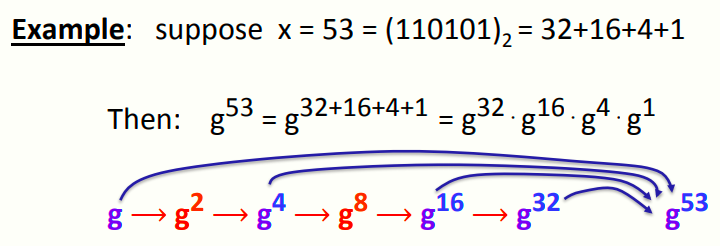
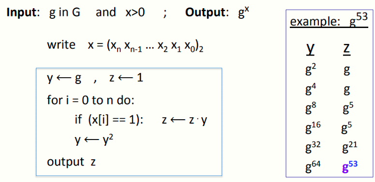

# W5 10-4 Arithmetic algorithms

## 1、Representing bignums 

计算机内如何表示大整数

比如有一台64 bits机器，想要表达一个n bits整数（如n=2048），可以将其分为若干个32 bits分组，然后得到n/32个分组，合在一起就可以了（由于32 bits分组相乘结果小于64 bits，因此64 bits的机器分组为32 bits）

现代处理器有128 bits甚至更大的寄存器，并且支持乘法运算，因此通常可以计算比32 bits更大的分组

## 2、Arithmetic 

接下来看基本计算，对于两个n bits的整数而言

对于加减法而言，都是线性时间内完成，即O(n)

对于乘法，笨一点的算法的复杂度是平方阶，Karatsuba在1960年给出了一个更优秀的算法，复杂度为O（n^1.58^），但是通常用于n很大的情况（比如大多数密码学算法库中的乘法运算）

对于带余除法，复杂度同样是平方阶

## 3、Exponentiation    

接下来用比较抽象的方法讨论指数运算问题

假设有一个有限循环群G，g为G的生成元，对于给定的x，计算g的x次幂

看上去很简单，如果硬算的话很费时间，尤其是g或x很大的时候就比较复杂了，甚至是指数阶的复杂度

因此介绍一个好的方法，重复平方法，例子如下

首先将幂数x写为二进制数，然后计算各个二进制位为1的对应的g的幂数，然后再全部乘起来就可以得到结果了

如图，一个简单的做法是用两个寄存器y和z，y始终保存平方运算的结果，z作为累加器，用于计算g的不同幂之间的乘法，对于输入的x而言，将其表示为二进制数，然后不断迭代，每次迭代时y都会平方，而z只有在当前位为1时才将y的结果乘进来

## 4、Running times

重复平方是一个非常快速计算g的高次幂的算法，本质上的迭代次数为logx，假设每次乘法都是平方阶复杂度，则进行一次指数计算的复杂度为O[(logx)⋅n^2^]，而实际上指数运算很慢，基本上都是立方阶复杂度