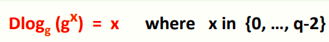
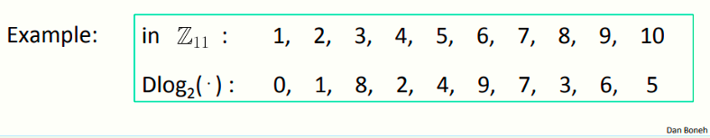
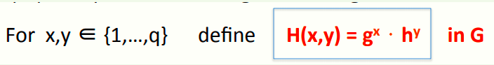
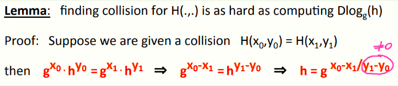
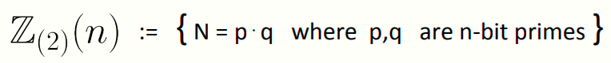
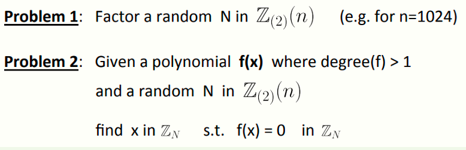

 # W5 10-5 Intractable problems

## 1、Easy problems

如找到模N下x的逆、找到模素数p的多项式f(x)=0的解等等问题，都比较好解决

但数论有一些问题还是比较难解决的

## 2、Intractable problems with primes

假设一个大素数p（比如有600 bits），然后记该素数的阶为p，根据上节课内容，若要计算Z~p~*内的某元素g的x次幂g^x^，重复平方法是个很简单有效的方法

现在考虑一个反问题，即上图所示，对于给定的g^x的值，计算其模p的对数，即找到模p下的x，比较困难，该问题也叫离散对数问题（Discrete logarithm，Dlog）

看个例子，p=11时以2为底的Dlog，mod 11时，2的0次幂为1，2^8^≡3 (mod 11)，依次类推

例子中的素数很小，对于小素数而言只需要计算，然后建立一个表格，需要使用时查表就可以了，而对于大素数（超过2000 bits），计算离散对数相当困难

## 3、DLOG: more generally

更一般的定义离散对数问题

记G为一有限循环群，g为G的生成元，q为G的阶
$$
G=\{1,g,g^2,g^3,...,g^{q-1}\}
$$
定义：若G上的Dlog是困难的，则对于所有高效的算法A而言其如下概率可忽略
$$
Pr_{g\leftarrow G,x\leftarrow Z_q}[A(G,q,g,g^x)=x] < negligible
$$
即在G中随机选择一个g，并随机选择一个指数x，给出g和g^x^的值，所有有效计算该Dlog的概率可忽略不计时，称离散对数问题在这个群G上是困难的

常用于构造Dlog难题的群有

* 由大素数p生成的Z~p~*
* 模p下的椭圆曲线（椭圆曲线上的点集）

前者上的Dlog比后者上的还要困难，因此椭圆曲线可以比Z~p~* 使用更小的参数，并实现和Z~p~* 中大素数同样困难的问题

## 4、Computing Dlog in (Zp)*

在Z~p~*上计算Dlog，之前讲过了，最好的算法为GNFS，一个亚指数阶的算法

## 5、An application: collision resistance

Dlog的应用：构建一个抗冲突的hash函数

首先选择一些计算离散对数困难的群G，且群G的阶q为一素数，选择G内的两个元素g和h，并定义如下hash函数

实际上这个hash函数是抗冲突的，因为找到H的冲突和计算G上的Dlog一样困难

引理：找到H(.,.)的碰撞和计算h的离散对数Dlog~g~(h) 一样难

证明：假设已知碰撞H(x~0~,y~0~) = H(x~1~,y~1~) ，则意味着有如上等式，然后把g和h分别移项到等号两侧，得到第二个等式，然后去掉h的幂次，即用g表示h，得到最右侧的等式

1/(y~1~-y~0~)意味着需要计算g模p的逆，而之前要求的G的阶为素数，确保了所有的元素都可逆，否则y~1~-y~0~=0意味着y~1~=y~0~，此时没有离散对数，又由第一个等式得到x~1~=x~0~，可以推出已知H(x~0~,y~0~) = H(x~1~,y~1~)实际上不是冲突，而是两个相同的值，不满足冲突的含义（冲突一定是y~1~≠y~0~）

需要注意的是，这个构造hash函数的方法有很好的抗冲突性，但是实际上因为效率问题并不怎么使用（比SHA-256要慢得多）

## 6、Intractable problems with composites 

一些模合数的问题

假设有如下一个整数集Z~(2)~(n)（比如n=1024 bits），集合内的元素N为两个n bits的素数相乘

对于上述集合，有如下两个难题

1. 对于集合中随机选择的N，分解N
2. 对于高次多项式f(x)和集合中随机选择的N而言，找到多项式的一个解（注意f(x)次数大于1，等于1就是线性方程了，很简单的）

高斯在1805年提到：区分素数和合数问题（即素性检验问题）以及将合数分解成素因子问题是算术中最重要最有用的问题之一

对于大合数分解而言，目前已知的最好算法为数域筛法（NFS），同样的亚指数阶的复杂度

目前记录为RSA-768（一个232位的十进制数），上百台机器花了两年分解，RSA-1024的复杂度约为RSA-768的一千倍，但是随着科技进步，有望在最近十年内完成