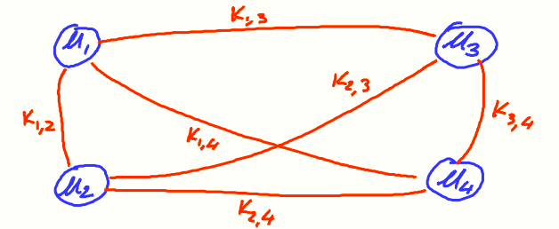
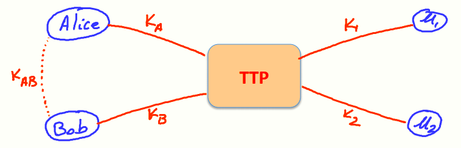
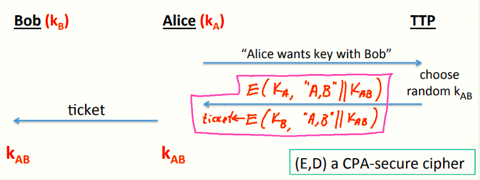

# W5 9-1 Trusted 3rd parties 

## 1、Key management

先看一个问题：假设有N个用户，这些用户如何管理用于相互之间通信的密钥？

最简单的做法是，每个用户之间都保存一个通信密钥，对于每个用户而言，需要保存的密钥数量为O(N)，是否有更好的解决办法？

## 2、A better solution

可以由更好的方案解决上述问题，其中一个为在线的可信第三方（Online Trusted 3rd Parties，TTP），模型如下

对于每个用户而言，需要将自己的密钥共享给TTP，每个用户都只需要记住自己的密钥就可以了

Alice和Bob如何通信？两者需要运行某种协议，使得在协议结束时双方都能获得共享密钥，且该共享密钥是攻击者不知道的

## 3、Generating keys: a toy protocol

首先，Alice和Bob都将自己的密钥K~A~和K~B~共享给了TTP，现在Alice想要和Bob协商一个共享密钥，模型如下

1. Alice先向TTP发消息，告知期望与Bob通信
2. TTP生成一个随机共享密钥K~AB~
3. TTP向Alice发送一条消息，包含以下两部分（加密系统E采用CPA安全加密方案）

* 用KA加密的K~AB~（图中"A,B"表示密钥K~AB~用于Alice和Bob的通信）
* 一个票据（ticket），ticket使用K~B~加密，内容与上一个一样

4. Alice收到后用K~A~解密得到K~AB~，若其想要和Bob通信时，将ticket发送给Bob，Bob解密得到K~AB~后即可开始通信

需要指出的是，上述模型仅在窃听下安全，对于篡改或者主动攻击并不安全，由于加解密方案为CPA安全的， 因此对于窃听者来说无法获得对K~AB~的信息

另外还需要注意的是，共享密钥是在TTP生成的，因此TTP下线或不可访问时，Alice和Bob就不能完成密钥交换，换句话说，TTP掌握了所有人的密钥，若TTP被攻击了，则攻击者可以轻松获取系统中曾经交换过的密钥

* 优点：快速高效，且仅仅使用了对称密码体制
* 缺点：TTP必须可信，谁来当这个可信第三方同样是个问题

Kerberos系统大概是这个机制（不完全是，思路和上面的这个方案类似而已）

## 4、Toy protocol: insecure against active attacks

上述方案很容易遭受重放攻击，下面讲一个例子

假设用户Alice和卖家Bob，Alice想在Bob那里买电子书书并完成了交易，Bob收到了书钱并发送给Alice这本书的一份拷贝

对于上述场景，攻击者可以完全记录这次对话并简单地向Bob重演这个对话，此时Bob会认为Alice重新购买了一份这本书的拷贝，Bob会再向Alice收一次钱并发送一次书的拷贝

## 5、Key question

问题来了：能否设计一个密钥交换协议，使其在窃听和主动攻击下都能确保安全，能否设计一个安全的密钥交换协议而不需要任何在线可信第三方组织

显然可以，三种方案如下

* 1974年还在读大学的Merkle提出的方案
* 1976年Diffie-Hellman的密钥交换协议
* 1977年公钥算法RSA

近十年来又出现的新的方案：

* ID-based enc. (BF 2001)，基于身份的加密，管理公钥的另一种方式
* Functional enc. (BSW 2011)，函数式加密，通过给出一个只能解密部分给定密文的密钥的方式完成