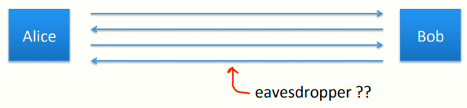
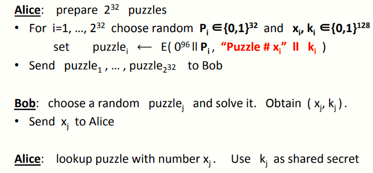
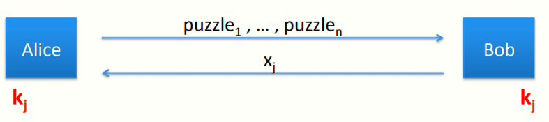

# W5 9-2 Merkle Puzzles 

## 1、Key exchange without an online TTP?

如图所示，假设Alice和Bob素未谋面，但是出于某种原因他们需要一个共享密钥，该模型下没有TTP，需要某种协议来互相发送消息并确定一个互相都知道的共享密钥

提问：对于上述模型，能否用对称加密机制实现没有可信第三方的密钥交换（可以使用加密，hash function或者其他目前已经学过的）？答可以

需要注意的是，目前仍然只讨论窃听安全，不涉及篡改等主动攻击（eavesdropping only，no tampering）

## 2、Merkle Puzzles (1974）

该协议由瑞夫·墨克(Ralph Merkle)在1974年发明（当时还在读本科，某次研讨会上发明的这个协议），遗憾的是，这个协议因为效率问题并没有使用

协议主要工具：puzzle，即一个非常难解决的问题，需要非常用心努力的解决

举个例子，比如说128 bits的AES密钥P，前96 bits均为0，后32 bits为随机生成，并用该密钥加密特定的消息

可以看出，密钥最多有2^32^种可能，对于每一种可能都用其解密并看看是否得到明文，如果得到了就还原了密钥P（即解决了puzzle）

回到协议，看看协议的工作流程：

1. Alice首先准备2^32^个puzzles，对i=1, …, 2^32^，选择随机的Pi∈{0,1}^32^，再随机选择128 bits的xi , ki ∈{0,1}^128^，令puzzle~i~=E( 0^96^ ll P~i~ , “Puzzle # x~i~ ” ll k~i~ ) ，并将这么多个puzzles发给Bob
2. Bob收到这么多puzzles后随便挑一个（其他的不要），假设选到了第j个puzzle并尝试解决，期望时间为O(2^32^)，解决puzzle后得到(x~j~ , k~j~)，将xj发回给Alice
3. Alice根据Bob发来的x~j~，找到对应的puzzle，然后共享密钥就是k~j~

换一个图，更直观的说一下这个协议流程

Alice的计算量：O(n) ，即准备n个puzzles

Bob的计算量：O(n) ，即解决其挑选的puzzle

窃听者攻破协议需要的计算量：O(n^2^) ，先得确定Bob选了哪一个puzzle，然后解决puzzle，因此计算量为平方阶

但是协议存在很大的问题：

* 通信双方的计算量很大，Alice发送这么多puzzles（大约16G或者更多），Bob解决一个puzzle也需要花一点时间
* 窃听者只需要在O(2^64^)内即可破解，实际上并不安全，使其便安全的方法为增大n，比如增大到2^64^，此时窃听者的破解期望为O(2^128^)，安全了，但是对于Alice和Bob来说这么大的计算量过于奢侈，也不现实

总结一下：尽管说非常不现实，但仍然是个不错的思路，该协议构造了一个平方差距(quadratic gap)，即通信方只需要线性阶的计算量，而实施攻击需要平方阶

新的问题：能否在仅使用对称加密的情况下构造比平方差距更好的安全性？不晓得

有一个值得思考的点是：平方差距是否是我们能够得到的最好的结果？不晓得，但是可以参考AES和SHA-256来思考密钥交换的设计思路

某些失败的例子表明，如果将块加密或者哈希函数作为一个黑盒，那么平方差距已经是最好的结果了

BM'09这篇论文中说平方差距是我们能够实现的最好结果（值得一看的论文）