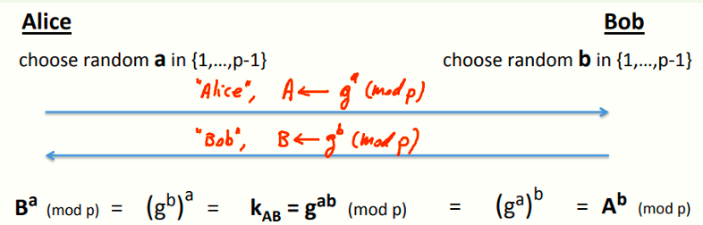
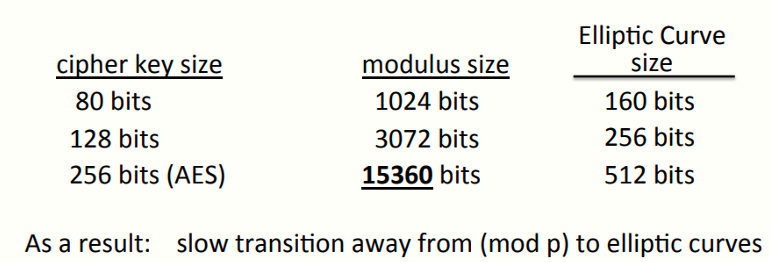
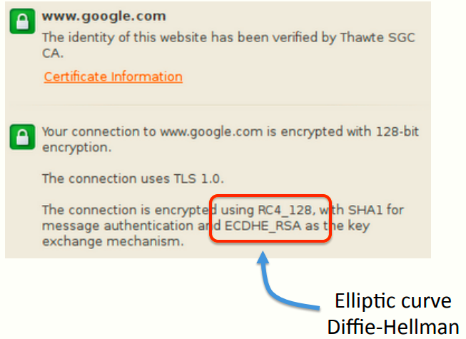
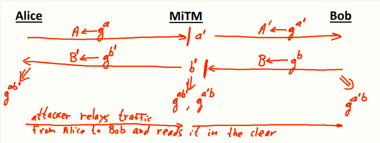
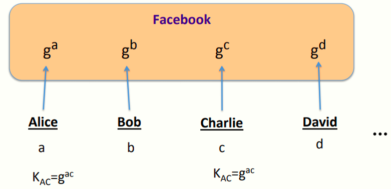
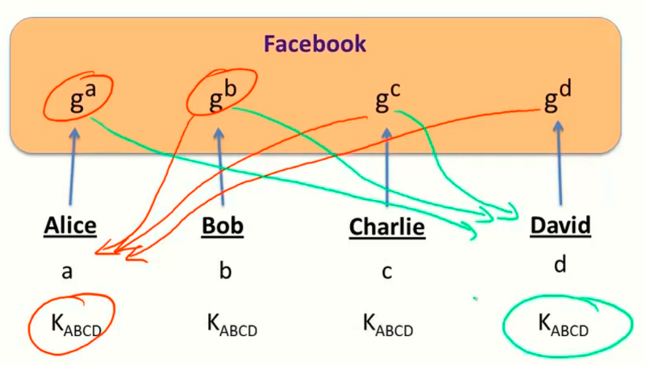

# W5 9-3 The Diffie-Hellman protocol 

## 1、复习与预习

上节课讲到了无需TTP的密钥交换，需要注意的是Alice和Bob素未谋面，但是为了完成安全的通信，因此需要交换一个共享密钥

上节课的内容主要围绕对称密码或者散列函数展开，并介绍了一个有用的协议Merkle Puzzles，可以在通信双方和窃听者之间产生平方差距，但是仍然是不安全的，且因为效率问题并不实用

因此本节课的内容，希望实现一种方案，使得通信双方与窃听者之间产生某个指数级的差距

需要注意的是，本节内容仍然围绕无TTP的密钥交换机制展开，还需要注意的是，目前仅针对窃听安全，即攻击者实际上只是一个窃听者，并不以任何方式修改数据包或向网络中注入数据等主动攻击

## 2、The Diffie-Hellman protocol (informally)

背景：1976年由斯坦福大学教授Martie Hellman和他的研究生Wig Diffie提出的协议

方案流程：事先准备一个大素数p（很大，600位以上的十进制数，或者2048 bits），然后准备一个整数g∈{1, …, p}，p和g都可以通过不安全的信道传送（即可以被窃听） ，然后协议如下

对于Alice，他随机选择a∈{1, …, p-1} ，计算A≡g^a^ (mod p)，并将A发送给Bob

类似的，Bob随机选择b∈{1, …, p-1}，计算B≡g^b^ (mod p)，并将B发送给Alice

好了，Alice和Bob此时可以用对方的发来的数再计算便可以得到共享密钥，对于Alice而言，计算B^a^ (mod p)，Bob计算A^b^ (mod p)，尽管计算的值不同，但是双方的计算结果是相同的，均为K~AB~≡g^ab^ (mod p)，从而Alice和Bob共享了一个密钥

## 3、Security 

注意到D-H密钥交换基于指数的运算性质，且本身的计算也是模幂运算

更关键的问题在于，安全吗？为什么一个窃听者就算知道了Alice和Bob自己计算的A和B也不能找出相同的共享密钥呢？

窃听者肯定可以知道模数p和底数g，同时可以切听到双方传送的A和B，问题在于窃听者能否根据这四个值计算出共享密钥，即计算K~AB~≡g^ab^ (mod p)

引入一个辅助定义，定义一个Diffie-Hellman函数，基于某个值g定义的函数，具体如下
$$
DH_g(g^a,g^b)=g^{ab} \ (mod \ p)
$$
问题来了：计算这个DH-g函数到底有多难？需要注意p是600位甚至更长的十进制数

假设一个素数p有n bits这么长，使用目前已知最好的算法（General Number Field Sieve，GNFS，一般数域筛法），期望的运行时间在指数的立方根的幂左右，即e^O(³√n)^，不是线性阶的也不是指数阶的，算是个次指数算法

上图展示了破解Diffie-Hellman协议的难度与破解具有适当位数的密码的难度的比较，为了达到与分组密码相当的安全性，D-H交换的密钥长度比分组密码要长的多得多

更长的密钥意味着更慢的效率，有没有办法可以解决效率问题？可以把D-H协议从一个素数的算术模型转换成一个不同类型的代数对象，即在另一个代数对象上解决D-H问题要更困难

另一个代数对象为椭圆曲线，在这些椭圆曲线上计算DH函数比计算DH模素数要困难得多，由于这个问题非常困难，因此可以使用更小的对象，也就是更短的密钥，如上图所示，椭圆曲线的密钥长度也就比分组密码的密钥长一倍而已

有些网站上写的ECDHE就是基于椭圆曲线的DH密钥交换协议

## 4、Insecure against man-in-the-middle

这两节的内容都是在仅窃听安全下讨论的，事实上该协议不能抗主动攻击，比如对于中间人攻击（MITM）就是不安全的，看下面这个模型

正常来说，Alice与Bob会准备好A和B并发送给对方，而此时中间人可以拦截Alice的A，并用事先准备好的a'计算得到新的A'并发送给Bob，同样的截获Bob的B并发送B'给Alice，本应当是Alice与Bob交换密钥，实际上是Alice和Bob分别与MITM交换了密钥

可以看到，MITM截获了A和B，并以自己的A'和B'与Alice和Bob交换密钥，因此他有了两个共享密钥，当Alice向Bob发送消息时，先用Alice的共享密钥解密，然后再用Bob的共享密钥加密后发送给Bob，这意味着MITM不仅可以知道通信内容，由于他可以解密，因此可以篡改内容

## 5、Another look at DH

D-H协议的一个有趣的性质：可以看作是一个非交互协议

如图，假设有很多用户，每个人都会选择自己的值acbd……并像之前一样计算对应的模数ABCD……，然后上传到自己的个人资料上

假设现在Alice想和Charlie通信，不需要像原来那样交换计算的值，只需要Alice和Charlie相互查看对方的资料，然后再根据自己的模数计算出共享密钥就可以通信了，省去了中间的密钥协商的过程

有一个值得思考的问题：假设还是这几个人，对于Alice而言，他能否在查看Bob，Charlie，David的资料后，即可建立属于这四个人的共享密钥，同理Bob在查看……后就可以……？也就是能否做到下面这个图所描绘的方案？

更一般的说法，对于N个通信方，能否非交互的来协商这N个通信方之间的共享密钥？

注意到N=2时，本质上就是D-H协议，对于N=3的情况，有一个已知的协议为Joux，但对于N=4或者更多的通信方，这仍然是一个开放的问题，搞定了说不定就举世闻名图灵奖各大高校名誉教授之类的