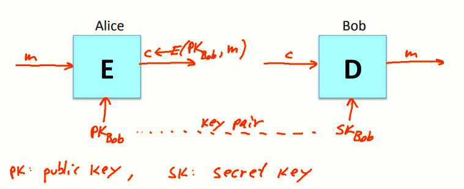
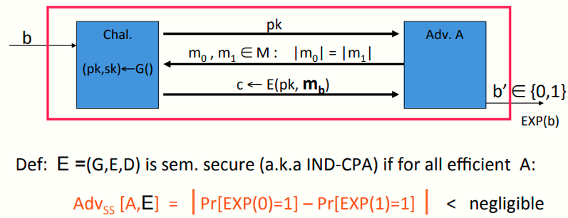
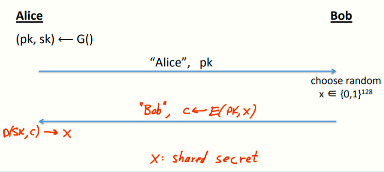
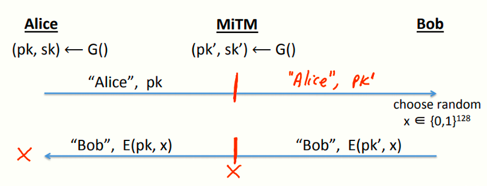

# W5 9-4 Public-key encryption 

## 1、复习

Alice和Bob素未谋面，需要建立共享密钥，仅讨论窃听安全

前两节课中介绍了一个基于一般分组密码的方案，可以做到平方差距，但是效率很低的，D-H协议可以达成指数差距，而且实际上应用非常广泛

本节讲另一个公钥加密方案

## 2、Public key encryption

和对称加密一样，有加密算法E和解密算法D，通常加密算法以公钥（Public Key，PK）作为密钥输入，而解密算法采用一个不同的密钥即私钥（Secret Key，SK），公钥和私钥通常也称为密钥对

可以和对称密码一样，输入消息和公钥，由加密算法产生密文，或者输入密文和私钥，由解密算法恢复明文

定义：公钥加密系统为一个算法三元组(G, E, D) ，其中

G()：随机化算法，用于产生密钥对

E(pk, m)：加密算法，输入明文和密钥，输出密文

D(sk,c)：解密算法，输入密文和密钥，输出明文，有错误的情况会输出bottom元素

公钥加密系统具有一致性，即对于任意由G输出的密钥对(pk, sk) ，公钥加密后的消息再用私钥解密会得到原来的消息

## 3、Semantic Security

接下来看语义安全的形式化定义，和以前一样，定义两个实验0和1让攻击者判断

首先，挑战者先运行密钥生成算法G来生成密钥对，然后把公钥给攻击者，私钥保密

然后攻击者和以前一样，构造两个等长的消息并发送给挑战者，挑战者选择其中之一加密后返回给攻击者

需要注意的是，公钥系统的语义安全中没有必要允许攻击者做选择明文攻击，因为攻击者已经获得了公钥，可以用公钥加密任何期望的消息，而不像前几章那样发起CPA让挑战者帮助他创建他选择的消息的加密

定义：若公钥加密系统E =(G,E,D) ，则其对于任意高效的攻击者，其上述优势为可忽略的

## 4、Establishing a shared secret

有了公钥加密系统，来看看如何建立共享密钥，如图所示

首先Alice先用G生成密钥对，然后把pk发给Bob，然后Bob生成一个随机的128 bits的值x，并用pk加密后发回给Alice，Alice收到这个密文后用sk解密后就可以得到x，此时可以用这个x作为共享密钥来通信

注意到这个方案是有顺序的，Bob在收到Alice的信息之前不能发出消息，即Bob需要得到Alice的公钥后才能用其进行加密x，但D-H协议没有这种先后顺序，只要是期望通信的双方，谁先发送都可以

## 5、Security (eavesdropping) 

接下来看安全性，仍然只讨论窃听安全

攻击者可以窃听到公钥和用该公钥加密的x的密文，其目的是想知道x的值，由于公钥系统是语义安全的，因此攻击者窃听到x的密文后，不能断定他的明文是x还是消息空间M中的其他值（除非他尝试所有可能的消息）

## 6、Insecure against man in the middle

但是协议仍然不能防止MITM攻击，攻击模型如下

首先Alice生成了密钥对(pk, sk)，同时MITM也生成了自己的密钥对(pk', sk')

当Alice发送公钥给Bob的时候，MITM会拦截这条消息，取而代之的是MITM用自己生成的密钥pk'给Bob发送消息，然后Bob返回x的密文时，先用自己的私钥sk'解密，再用Alice的公钥pk加密后返回给Alice

MITM经过上述模型后，不仅Alice和Bob共享了密钥x，MITM也知道了x，因此协议不安全了

## 7、Public key encryption: constructions 

公钥密码的构造通常基于数论和代数中的数学难题（如D-H协议基于代数知识）

## 8、Further readings

* Merkle Puzzles are Optimal, B. Barak, M.Mahmoody-Ghidary, Crypto ’09：证明了在基于对称加密算法和Hash函数的方案下，Merkle puzzle是密钥交换的最优解
* On formal models of key exchange (sections 7-9) V. Shoup, 1999：总结了一些密钥交换机制，包括基于公钥密码学的，基于D-H协议的