# W5 Problem Set && Programming Assignment

Q1

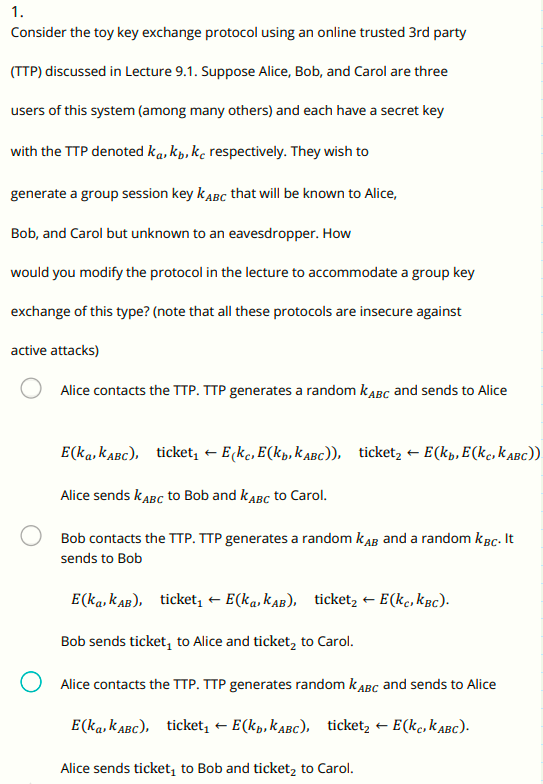

问：考虑一个简易的密钥交换协议，使用TTP，假设Alice、Bob、Carol为该系统中的三个用户（还有其他用户），每个人都有自己的密钥，记为k~a~，k~b~，k~c~，他们三人期望生成一个组内共享的密钥k~ABC~，仅有他们三人知道，其他人和窃听者不知道，如何修改课程中介绍的协议以适应这种类型的组密钥交换(请注意：所有这些协议对于主动攻击都是不安全的）

答：第三个选项正确，窃听者只能看到k~ABC~的加密的结果，而Bob和Carol可以正确使用k~ABC~，前两个都不行

Q2

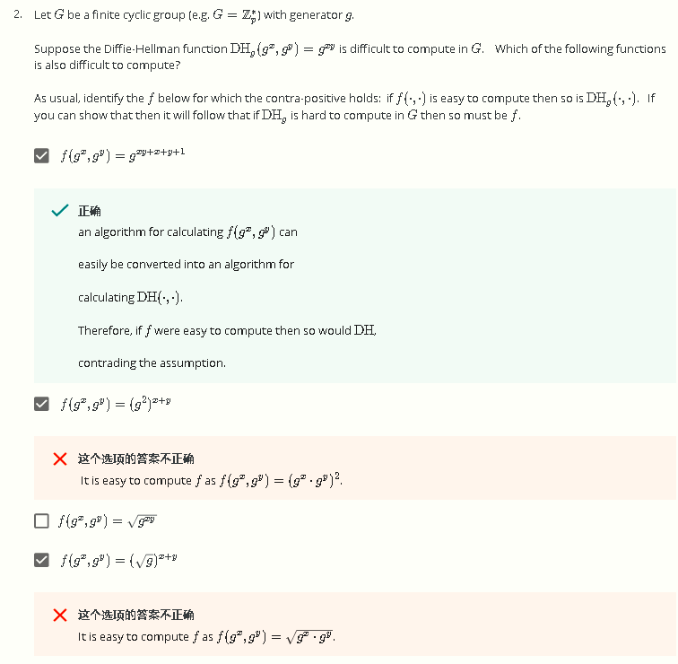

问：记G为一有限循环群，生成元为g，假设D-H函数如图所示，其在G上计算困难，则下列哪个函数也是计算困难的？

答：

1. 由于g^xy^难计算，所以第一个选项的表达式也难计算
2. 第二个选项表达式可以转换成g^x^·g^y^
3. 第三个同理
4. 第四个同理

Q3

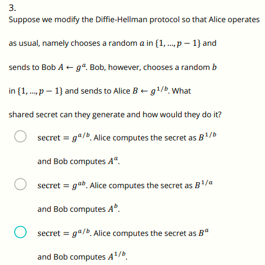

问：假设修改一下D-H协议，Alice和以前一样随机从{1, …, p−1}中选择a，然后将A=g^a^发送给Bob，但Bob选择b之后计算B=g^1/b^，则他们之间会生成何种共享信息，应当如何操作？

答：还是和原来一样，Alice把收到的B和自己的A乘起来，Bob同理，最后得到共享信息g^a/b^，然后分别按原来的流程计算各自的参数即可

Q4

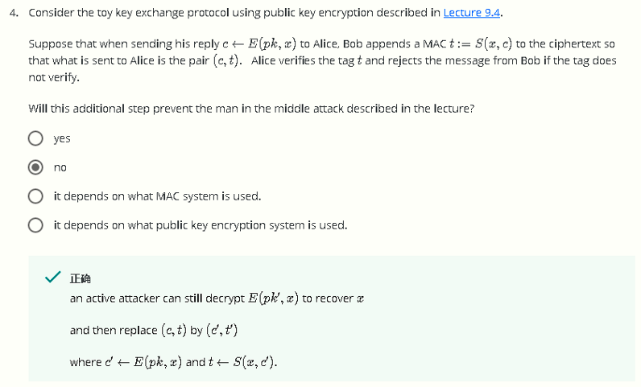

问：考虑一个采用公钥加密的密钥交换协议（如9-4中的那种），假设Bob发送c=E(pk,x)给Alice时，在尾部加入一个MAC t:=S(x,c)，Alice此时收到(c,t)，然后Alice验证这个tag t，如果验证不通过则拒绝这条消息，则这个额外的添加MAC的步骤可以防止MITM攻击吗？

答：不行，主动攻击者依然可以用自己的密钥来代替原来的pk，并重新计算密文和MAC

Q5

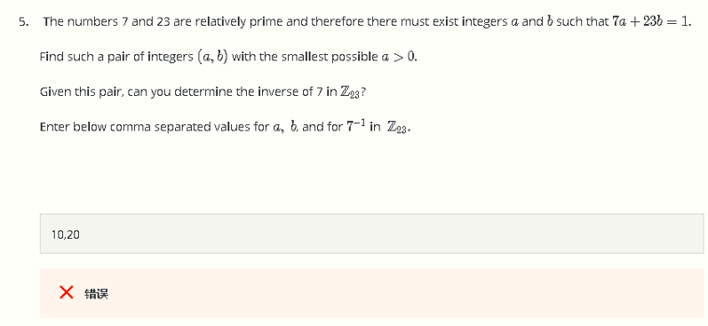

问：对于7a+23b=1这个等式，找到一对整数对(a,b)，使其满足该等式且a为最小正整数，对于这个整数对(a,b)，能否确定7在mod 23下的逆？

答：a=23n+10，b=-7n-3，取n=0即可，即(a,b)=(10,-3)

 

Q6

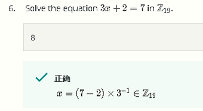

问：计算3x+2 ≡ 7 (mod 19)

答：8

Q7

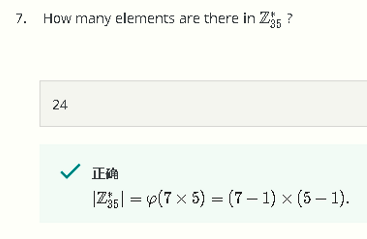

问：模35中与35互素的数有几个

答：由欧拉φ函数可知有24个

Q8

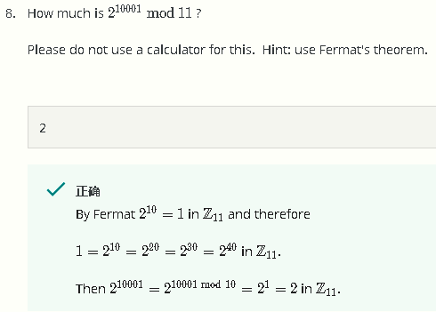

问：2^10001^ mod 11的结果

答：由2^10^ ≡ 1 (mod 11)可知，2^10001^ ≡ 2·(2^10)^1000 ≡ 2 (mod 11)

Q9

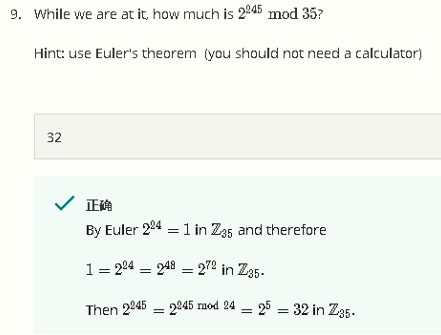

问：

答：和上一题类似解法

Q10

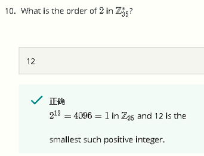

问：模35下2的阶

答：12

Q11

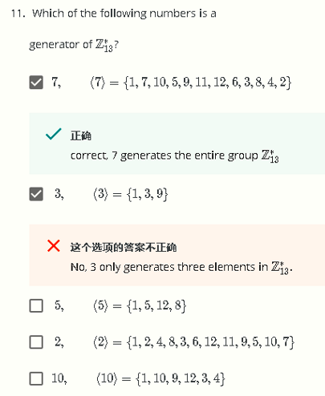

问：Z~13~*的生成元是哪个

答：

Q12

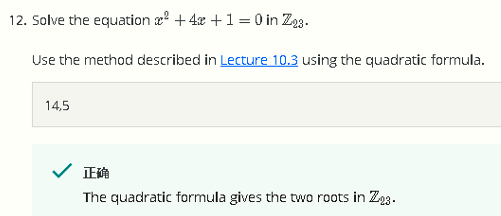

问：mod 23下解二次同余式

答：14和5

Q13

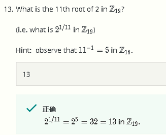

问：模19下2的11次根

答：13

Q14

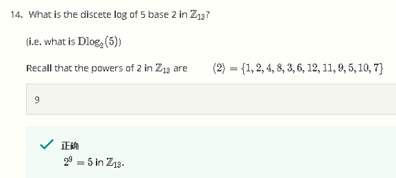

问：模13下2为底5的离散对数

答：9

Q15

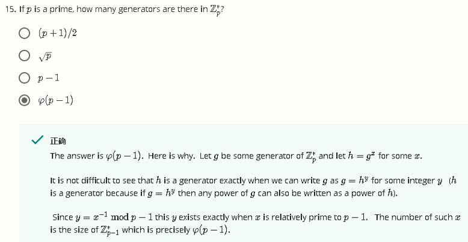

问：若p为素数，则Z~p~*的生成元有多少个

答：