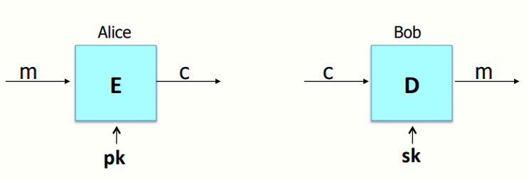
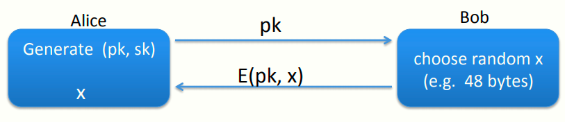
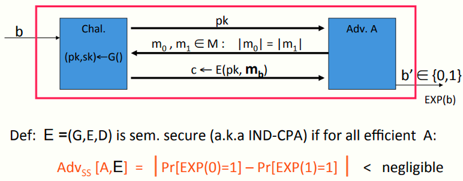
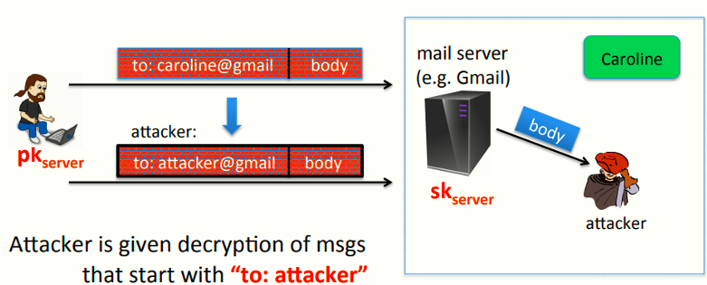
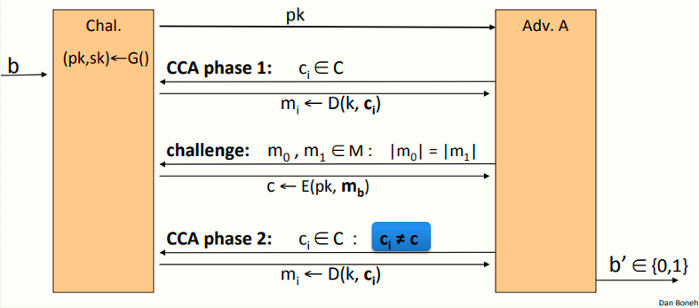
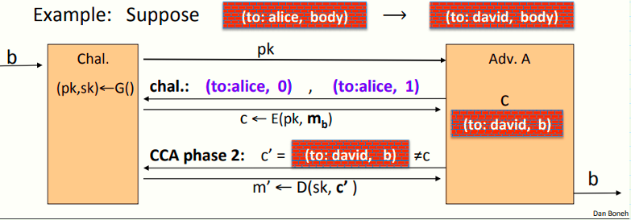

 # W6 11-1 Public key encryption: definitions and security

## 1、Public key encryption

和上一章讲的一样，公钥加密需要一个密钥对，公钥加密，私钥解密

## 2、Applications

常见的应用为浏览器和服务器之间建立安全密钥，模型如下（仅窃听安全）

对于非交互的应用，比如电子邮件也会用到

Bob先用Alice的公钥加密邮件信息后给他发邮件，然后Alice用自己的私钥解密即可

## 3、Public key encryption

回顾第九章的知识

定义：公钥加密系统为一个算法三元组(G, E, D) ，其中

* G()：随机化算法，用于产生密钥对

* E(pk, m)：加密算法，输入明文和密钥，输出密文

* D(sk,c)：解密算法，输入密文和密钥，输出明文，有错误的情况会输出bottom元素

公钥加密系统具有一致性，即对于任意由G输出的密钥对(pk, sk) ，公钥加密后的消息再用私钥解密会得到原来的消息

## 4、Security：eavesdropping

接下来看语义安全的形式化定义，和以前一样，定义两个实验0和1让攻击者判断

首先，挑战者先运行密钥生成算法G来生成密钥对，然后把公钥给攻击者，私钥保密

然后攻击者和以前一样，构造两个等长的消息并发送给挑战者，挑战者选择其中之一加密后返回给攻击者

需要注意的是，公钥系统的语义安全中没有必要允许攻击者做选择明文攻击，因为攻击者已经获得了公钥，可以用公钥加密任何期望的消息，而不像前几章那样发起CPA让挑战者帮助他创建他选择的消息的加密

定义：若公钥加密系统E =(G,E,D) ，则其对于任意高效的攻击者，其上述优势为可忽略的

## 5、Relation to symmetric cipher security 

对称加密与公钥加密的关系

之前在讨论对称加密算法的安全时，我们关注密钥使用一次和多次的安全性

在公钥密码系统中，如果一个系统在一次性密钥时是安全的，则多次密钥也是安全的，也不必赋予攻击者请求加密他选择明文的能力，因为攻击者有公钥，可以加密任何其想要的消息

## 6、Security against active attacks

接下来看更为强大的主动攻击

比如Bob想要发邮件给他的小伙伴Caroline，加密邮件先送到Gmail服务器，服务器解密邮件后查看收件人并转发给收件人

假设Bob使用的加密系统不安全，攻击者可以在不被察觉的情况下篡改密文，因此攻击者截获邮件后可以修改收件人为attacker

## 7、(pub-key) Chosen Ciphertext Security: definition 

目标：即便攻击者在可以篡改密文或解密特定密文的情况下仍然安全的公钥系统

加密方案E = (G,E,D) ，明文与密文空间(M,C)，定义实验0和1

查询阶段1：攻击者从密文空间选择一系列消息c~i~，请求挑战者为其解密为一系列对应的明文m~i~，直至攻击者结束查询

挑战阶段：之后攻击者构造等长消息m~0~和m~1~，并发送给挑战者，挑战者根据其选择的实验返回对应的密文c

查询阶段2：最后，攻击者提交密文c~i~≠c，挑战者返回其明文

此时攻击者可以选择解密任何与挑战密文不同的密文，并分辨挑战密文为m~0~还是m~1~的加密，如果不能，则代表这个系统是CCA安全的

定义：若E为CCA安全（indistinguishability under chosen ciphertext attack），则对任意高效的A而言，其如下优势可忽略
$$
Adv_{CCA}[A,E] \ = \ |\ Pr[EXP(0)=1]\ -\ Pr[EXP(1)=1]\ |
$$
看个例子

和之前的邮件的例子一样，假设加密系统仅给出一条消息的加密，而攻击者可以把收件人从Alice修改为Charlie，这会导致攻破上述安全模型

首先攻击者获得公钥pk，然后产生两条等长消息（如图），挑战者会返回其中一条消息的密文，而后攻击者用其能力，将Alice修改为Charlie，之后提交查询，从而知道第二步中返回的密文中的b是0还是1，从而攻击者赢得安全游戏的优势为1

## 8、Active attacks: symmetric vs. pub-key

安全的对称加密可以提供认证加密，即提供保密性和密文完整性，意味着攻击者不能构造一个通过认证的密文

公钥密码系统中，由于公钥pk公开，攻击者可以使用pk构造任何其想要的密文，因此需要确保选择明文安全