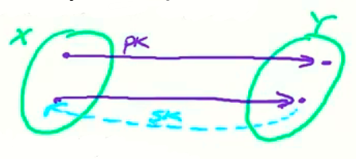
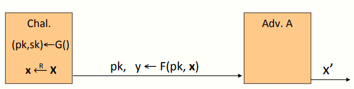
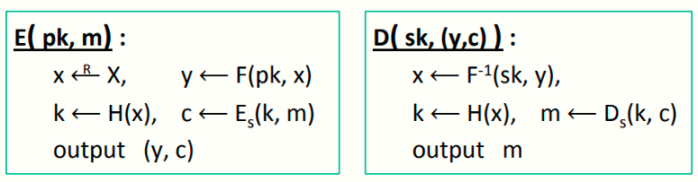
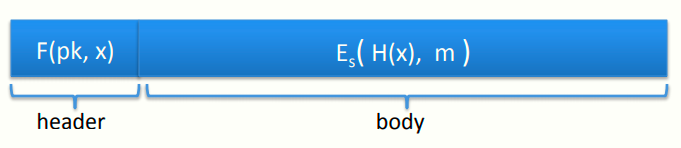

 # W6 11-2 Constructions

本节内容：陷门置换的概念

## 1、Trapdoor functions (TDF)

定义：陷门函数X⟶Y为一算法三元组(G, F, F^-1^) ，其中

* G()：生成公钥私钥对(pk, sk) 
* F(pk,⋅)：确定性算法，以pk作为输入，定义X⟶Y的函数
* F^-1^(sk,⋅)：以sk作为输入，定义Y⟶X的函数，即F的逆函数

更具体而言，对于由G生成的任意密钥对(pk, sk) ，任给消息x∈X，都有F^-1^(sk, F(pk, x) ) = x，也就是pk和sk对于集合X和Y有如下映射关系

## 2、Secure Trapdoor Functions (TDFs) 

当F(pk,⋅)为一单向函数时，(G, F, F^-1^)为安全的TDF，也就是说，该函数F在某个点求其值很简单，在没有私钥sk的情况下求逆值很困难

同样以安全游戏的方式定义，挑战者先由G生成密钥对，然后计算y=F(pk,x)，并把pk和y发给攻击者，攻击者的目标是求y的逆，记其输出为x'

定义：若(G, F, F^-1^)为一安全TDF，则其对于所有高效攻击者A而言，其如下优势可忽略
$$
Adv_{OW}[A,F]=Pr[x=x']<negligible
$$

## 3、Public-key encryption from TDFs

利用陷门函数的概念建立公钥加密系统

(G, F, F^-1^):为X⟶ Y 的安全TDF

(E~s~, D~s~) :为定义在(K,M,C)上的对称加密系统，提供认证加密

H: X ⟶ K，hash函数

需要注意的是，对称加密的密钥空间K和TDF里面的输入空间X不是同一个集合

首先运行算法G得到公私钥对(pk, sk) 

加密算法：以消息m和pk作为输入，先在集合X中随机生成一个x，由单向函数F计算值y，hash函数计算x的hash值k，以k为密钥使用对称加密算法E计算消息m的密文c，加密算法输出(y, c)

解密算法：以sk和(y, c)作为输入，先由sk计算y的逆，得到x，然后计算x的hash值k，由k和解密算法D计算c的明文m

注意到加密过程中的陷门函数仅作用于算法随机生成的x而非输入的消息本身，使用的hash函数应当是一个理想的hash函数

从实际的角度来说，由于消息m可能是非常长的明文，如上图所示，先由首部得到密钥，再由密钥解密后面的消息

安全定理：如果(G, F, F^-1^)为一安全TDF，(E~s~, D~s~) 提供认证加密，H: X ⟶ K为一随机预言（random oracle，即hash函数应当是理想化的），则(G,E,D) 为CCA-ro安全（ro即random oracle，随机预言模型）

## 4、Incorrect use of a Trapdoor Function (TDF)

需要注意一些错误的使用TDF的方式，比如直接将F函数作用于明文消息m，由于没有用到任何随机，加解密是完全确定的，几乎不可能做到语义安全，从而导致许多攻击方法（下一节介绍）