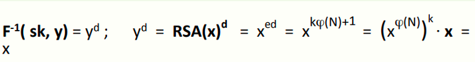
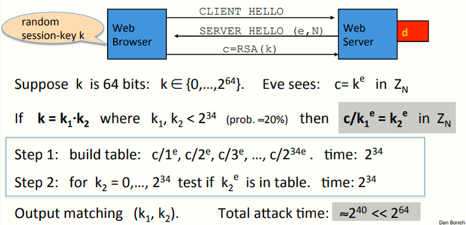

 # W6 11-3 The RSA trapdoor permutation

## 1、Review: trapdoor permutations

上一节课介绍了陷门函数建立公钥加密系统，本节介绍RSA的陷门函数

回顾一下上节课系统的组成：三个算法(G, F, F^-1^) 

本节课介绍陷门置换（trapdoor permutations），一个将X映射到X自身的函数（区别于陷门函数将X映射到Y），但和陷门函数一样，陷门置换在没有私钥sk时求其逆是困难的

## 2、Review: arithmetic mod composites

然后再回顾一下数论的知识

记N=p·q（p，q为两个位数差不多的素数）

Z~N~：模N的所有可能的结果组成的集合，即ZN = {0,1,2,…,N-1}

Z~N~* ：ZN中存在逆的元素构成的集合，也是ZN中与N互素的元素构成的集合，Z~N~*元素的个数记为|Z~N~*|，可以用欧拉函数求得

需要注意的是，当且仅当gcd(x,N) = 1时，x可逆

欧拉定理：∀x∈Z~N~*，x^φ(N)^ ≡ 1 (mod N)

## 3、The RSA trapdoor permutation

历史：最早在1977年8月提出，已有超过40年历史，由Rivest、Shamir、Adleman三人的首字母组成

应用：广泛应用于SSL/TLS协议的认证和密钥交换部分，e-mail安全和文件系统安全，以及其他一些需要安全解决方案的场景

首先看看密钥生成算法G()

* 选择两个大素数p和q（1024 bits左右，大约是300位的十进制数），计算N=p·q，φ(N)，然后选择两个整数e和d，使其满足e⋅d = 1 (mod φ(N) )，之后输出公钥pk = (N, e) , 私钥sk = (N, d) 

F(pk , x)：一个Z~N~*到Z~N~*的映射，简记为RSA(x)=x^e^ (mod N) 

F^-1^( sk, y ) : =y^d^ (mod N) ，具体正确性如下

## 4、The RSA assumption

为什么这个函数是安全的？

先声明一个RSA假设：RSA为一单项置换，对于所有高效的算法A而言，其如下概率可忽略
$$
Pr[A(N,e,y)=y^{1/e}]<negligible
$$
其中p和q为n bits素数，N=pq，y为Z~N~*中随机选择的数，对于算法A输入模数N，指数e以及点y，其计算y的逆的概率可忽略不计

上述假设大致说明了RSA是只给出公钥的单向置换，因此这是一个陷门置换，对于知道陷门（私钥）的人来说计算y的逆非常容易

## 5、Review: RSA pub-key encryption

有了单向陷门之后，就可以将其应用于公钥密码系统

上一节提到的那个公钥密码系统中，(Es, Ds)表示提供认证加密的对称密码系统，hash函数提供对称密码的密钥，将本节课的RSA单向陷门应用到该系统后，工作流程如下：

* G()：生成RSA参数，pk = (N,e), sk = (N,d) 
* E(pk, m)：加密算法，首先在Z~N~中随机选择一个数x，计算y=RSA(x)，k=H(x)，输出(y , E~s~(k,m) ) 
* D(sk, (y, c) )：输出D~s~( H(RSA^-1^ (y)) , c)

实际应用中，hash函数采用SHA-256实现

根据上节课介绍的安全定理，RSA为安全的TDF，E和D为提供认证加密的对称密码，H为随机预言，则该系统为CCA安全的

## 6、Textbook RSA is insecure

上面介绍了一个可用且好用的公钥加密系统，但是需要注意的是，不要用RSA加密，即不要直接用RSA加密给定的消息m（所谓的教科书式的RSA），因为他是确定性加密，不可能是语义安全的，存在很多攻击

因此RSA只是一个陷门置换，本身不是一个加密系统，但是可以将其与其他东西组合来构建一个加密系统（比如上面介绍的那种）

接下来看一下针对这种所谓的教科书式的RSA的攻击

假设有一个web服务器，服务器有私钥(d,N)，此时浏览器期望建立安全会话，首先浏览器发送第一次握手，服务器第二次握手并返回其公钥(e,N)，浏览器直接使用RSA加密会话密钥k（假设k为64 bits非负整数）得到密文c

攻击者的工作：

假设k可以分解为大小差不多的两个数k~1~和k~2~，且二者都小于2^34^（该事件发生的概率约为1/5）

由于公钥e公开，攻击者窃听到密文c后，可以将其原来的k用k~1~·k~2~来替换，然后再移项得到上图中第一个灰色框的等式

然后进行中途相遇攻击，构建上述Step 1中的表（即等式左侧所有可能的值），然后计算k~2~的e次幂（等式右侧的值）与表中的项匹配，找到碰撞后输出(k~1~, k~2~)即可，即k=k~1~·k~2~

总的期望时间大约是2^40^