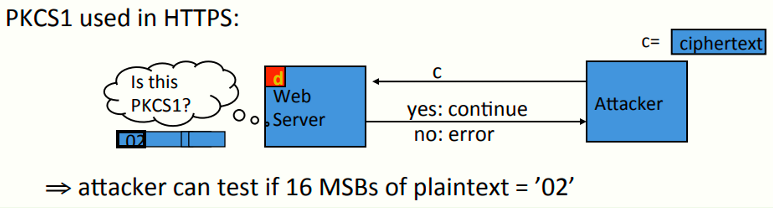

 # W6 11-4 PKCS 1

本节介绍RSA的实际运用，即PKCS 1

## 1、RSA encryption in practice

首先反复强调，不要使用教科书式的RSA，在使用RSA函数前需要对消息进行处理，比如生成随机数x，用RSA加密x，再通过x派生出对称加密密钥

上节课介绍了一些简单的模型，但不是实践中RSA的用法，实践中不同的是RSA加密给定的对称密钥而不是生成对称密钥作为RSA加密的一部分

比如说一个128 bits的AES密钥，先将其扩展到2048 bits，然后再应用RSA函数

## 2、PKCS1 v1.5

PKCS广泛应用的为1.5版本，模式2表示加密（模式1为签名）

如图所示，尾部的msg表示需要扩展的128 bits的AES密钥，然后加入0xFF，之后加入随机填充（该随机填充任意一处不包含0xFF），最后再在最前面加上0x02（表示PKCS采用模式2），最终得到一个2048 bits的字符串

之后将上述整体作为RSA函数的输入，之后得到PKCS的密文，解密方解密后得到这个分组，然后移除0x02，移除直到连续的FF位置，最终得到后面的msg

有趣的是https用过这个1.5版本，实际上没有安全性证明这个模型真的安全，但确实曾经应用比较广泛

## 3、Attack on PKCS1 v1.5

1998年Bleichenbacher 提出了一个非常优雅（pretty elegant）的攻击

假设攻击者拦截了特定的PKCS1分组（还未输入RSA之前的那2048 bits），记RSA的输出为PKCS密文

攻击者直接向web服务器发送密文，web服务器尝试用私钥解密，查看解密结果的前两字节是否为0x02，是则继续，否则返回错误消息，因此攻击者可以得知该密文解密后的明文的前两字节是否为0x02

此时可以发起CCA如图所示：攻击者从ZN中随机选择一个r，利用截获的密文c和r构造一个新的密文c'（构造方式如图），然后将c'发送给服务器，服务器会返回前两个字节是否正确，只要构造的c'很多，最终可以恢复出想要解密的密文

## 4、Baby Bleichenbacher

还是介绍这个攻击，但是换一个相对简化的模型来介绍，假设web服务器解密之后不是检查前两个字节是否为0x02，而是检查第一个bit是否为1，然后假设RSA的模数N为2的某个次幂（而不是实践中的两个大素数的积）

此时攻击者发送密文c给web服务器后，通过观察服务器行为可以知道其明文的第一位是否为1

然后将2的e次幂与c相乘，可以得到(2x)^e^，也就是将x左移一位，然后将其发送给服务器，就可以得到x的第二位是否为1

然后将4的e次幂与c相乘，……，……左移两位……得到x的第三位是否为1

重复上述步骤直到完全恢复x

上述简化的Bleichenbacher只需要1000~2000次查询即可完成恢复，而完整的Bleichenbacher由于是检查前两字节是否为0x02，因此大约需要上百万次查询才可以完成

## 5、HTTPS Defense

那么问题来了，如何防御上述攻击？RFC 5246给出了一些做法

如果解密之后不是0x02开头的话，协议会选择一个随机的46字节的串R并假定主密钥是这个串R，但是不告知开头是否是0x02，然后继续协议，稍后由于这个串没什么意义从而导致协议失效（客户端和服务端密钥不一致从而导致会话终止）

上述方法好处在于假装明文是某个随机值，且服务端的代码改动比较小，修改和部署代价不大

## 6、PKCS1 v2.0: OAEP

另一种使用RSA加密的方法：最优非对称加密填充（Optimal Asymmetric Encryption Padding，OAEP），1994年由Bellare和Rogaway提出，在PKCS1 v2.0版本支持OAEP，工作方法如下

假设需要加密的消息为msg（如128 bits的AES密钥），然后在其尾部附上填充（先是01，然后是若干bits的0，0的数量取决于标准），然后随机选择一个值rand，使得整个字符串（msg+填充+rand）和RSA的模数一样大（比如2047 bits）

先将rand输入hash函数H，产生和左侧串相等长度的hash值，并把这个hash值和左侧串异或，异或的结果输入另一个hash函数G，将G的输出与rand异或后得到下边右侧部分，两个部分拼在一起得到2047 bits长的串，最终这个串（下面的这个）将输入到RSA函数

2001年由Fujisaki、Okamoto、Pointcheval和Stern证明了一个理论：假设RSA为一安全陷门置换，则上述使用RSA的模式（RSA-OAEP）在H和G为理想的hash函数的条件下为CCA安全的

需要注意这个理论是依赖于RSA的特殊性质，如果使用一些其他的一般的不具有RSA的代数性质的陷门置换，则这个定理完全错误，实际使用时会使用SHA-256来作为H和G的hash函数

## 7、OAEP Improvements 

那么如果我们只有普通的陷门置换，如何正确使用OAEP？可以，需要做一些微小的改动，两种做法

第一种：OAEP+

任给陷门置换F，采用hash函数W(m,r)替换OAEP中的固定填充（其中m和r为原来的那些，作为W的输入），只要H、G、W为理想hash函数，这个OAEP+就是CCA安全的

第二种：SAEP+

本质上还是以来RSA的性质，当公钥中的指数e=3时，可以不进行第二阶段的加密，但与OAEP+中使用了hash函数W，同样的H和W为理想hash函数时为CCA安全

需要注意的是这些OAEP的变体实际上并没有使用，真正实际使用的是标准化的OAEP

还需要注意的是，加密中的填充检查在所有机制中都是很重要的，如果填充不正确说明密文无效（即系统输出了bottom元素）

随堂小作业：SAEP怎么解密

## 8、Subtleties in implementing OAEP

实现OAEP很复杂，而且对时序攻击很脆弱，想用的话可以用OpenSSL里的OAEP