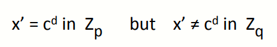

# W6 11-6 RSA in practice

## 1、RSA with Low public exponent

上节课提到了，如果想加速RSA的加密，使用小的加密指数e没问题，需要注意的是最小的合法的加密指数e=3（1显然不对，2与模数不互素）

一般而言，推荐使用2^16^+1=65537，利用重复平方法，只需要计算16+1=17次乘法，比采用随机的e快得多得多，但也导致了RSA的加解密速度不对称（解密可能需要上千次乘法）

有一种小技巧可以稍微提升RSA解密速度，利用中国剩余定理（Chinese Remaindering Theorem，CRT），可以将RSA解密速度提高四倍，但仍然比加密慢得多（速度比例大约是1：10~1：30，随模数大小变化而变化）

加密比解密快得多是RSA特有的性质，下节课讲的ElGamal没有这种（ElGamal加解密速度差不多）

## 2、Key lengths

公钥密码系统想要做到与对称密码系统相当的安全性需要更长的密钥

## 3、Implementation attacks

RSA从数学角度来说几乎完美，但是还是容易遭到侧信道攻击以至于不可靠

Paul Kocher在1997年提出的一种时序攻击，在测量计算c^d^  (mod N)的时间开销可以分析出d的值，如果想自己实现RSA解密，需要确保解密时间与参数无关

还是这个Paul Kocher，1999年提出了一个攻击，如果有一个实现RSA的解密卡，可以通过测量解密时的电量消耗，可以分析出d

最后一种称为缺陷攻击，表明RSA易受到揭秘错误的损害，即RSA解密中出现错误可能导致密钥完全泄露，因此许多密码库在解密后会验证结果，验证完毕后才把结果返回给调用者，但由于验证需要一定时间开销（大约是解密的1/10），因此有些地方也不采用

因此如果自己实现RSA的话，的确是数学上正确的，可以正常使用，但是会存在许多潜在的攻击，因此一定要用标准库

## 4、An Example Fault Attack on RSA（CRT）

RSA解密通常是分别计算模p和模p的结果x~p~和x~q~，然后再利用CRT将两者结合起来，这样可以把解密速度提高四倍

然后展示一例对于RSA-CRT的缺陷攻击，假设解密库正在计算模p的结果，出于某种原因，处理器犯了个错误，导致其没有输出正确的x~p~，而x~q~没有出错，在这种情况下，将输出记为x'，即有如下图所示，x‘对于模p结果正确而模q结果不正确

此时将上述模p的等式两侧取e次幂，由于e与d互为逆元，因此等式右侧取e次幂后得到c，左侧为( x' )^e^，即( x' )^e^ ≡ c (mod p)，但相同的操作（取e次幂）模q时不等于c，因此有如下最大公约数表达式
$$
gcd(  (x')^e-c,N  )=p
$$
即二者的最大公约数为p，由于N=p·q，而( x' )^e^-c为p的倍数，因此其与N的最大公约数为p

因此通过上述错误，可以得到N的因子分解之一，得到因子分解之后就可以计算φ(N)，然后再根据公钥e计算出私钥d，也就是说，只需要解密的一个小错误就可以导致恢复私钥，因此RSA解密时应当检查结果（尤其是使用CRT来加速解密过程的时候）

## 5、RSA Key Generation Trouble

Heninger et al 和 Lenstra et al 在2012年发现的一个新的攻击，表明如果RSA产生密钥时的熵很小，就会出现问题

OpenSSL生成RSA密钥的方法如图所示，先给伪随机数生成器一个种子，然后使用了伪随机数生成器生成的随机字符串来生成第一个素数p，接下来再次赋予种子并生成另一个随机数，从而得到素数q，最后输出p和q的乘积

假设上述过程是在某个路由器或者防火墙内部实现的，同时假设生成密钥恰好在防火墙开启后不久（比如防火墙刚启动后），prng的熵很低，导致其很可能从一个低熵的内核熵池生成素数p（即p可能的取值很少），而得到p之后，防火墙有了更多的熵，则素数q在一个更大的内核熵池中生成

因此会带来一个问题，许多不同的防火墙中生成RSA密钥时，很可能会生成相同的素数p，但是q会不同，如果观察两个不同防火墙生成的两个RSA的模数N~1~和N~2~，并计算两者的最大公约数，由于p相同而q不同，因此实际上找到了一个因子p，从而分解了两个大整数

这两个人的团队做了些实验，扫网并找出不同网络服务器的公钥，利用算术技巧计算最大公因数并进行因子分解，实验结果表明他们可以对大约0.4%的SSL公钥进行因子分解

教训：生成密钥时（无论使RSA密钥、ElGamal密钥还是对称密钥），使用合适的随机数种子非常重要，因此不要开机后里面生成密钥，确保生成器有足够的时间获取足够的熵，然后再生成密钥

## 6、Further Reading

Why chosen ciphertext security matters,V.shoup,1998，讨论了CCA安全在公钥设置中的重要性，讨论了许多蕾丝的攻击形式

tewnty years of attacks on the RSA cryptosystem,D.Boneh,Notices of the AMS,1999，Dan Boneh教授自己写的，详细探讨了对RSA的攻击

OAEP reconsideredV.SHoup,Crypto 2001

Key lengths,A.Lenstra,2004，分析了RSA密钥长度和其他公钥系统