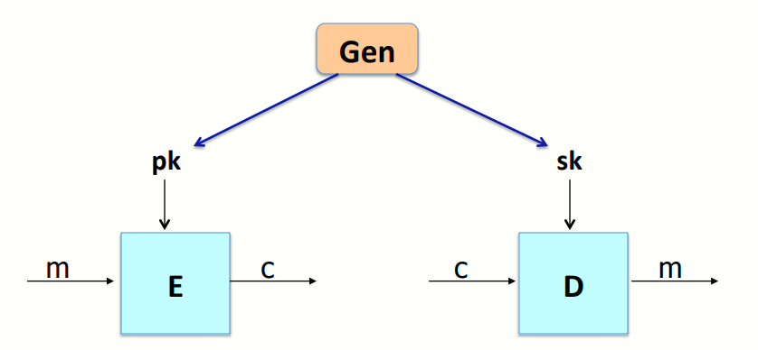
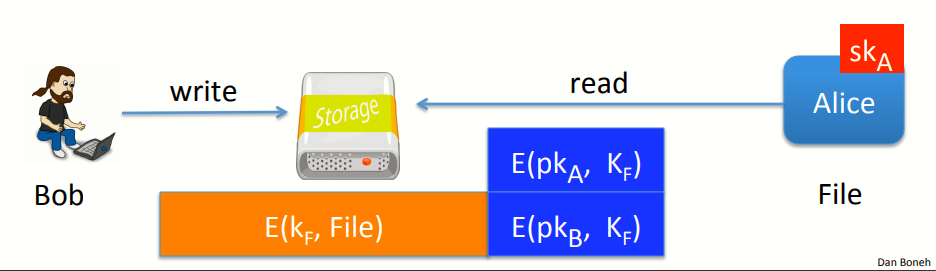
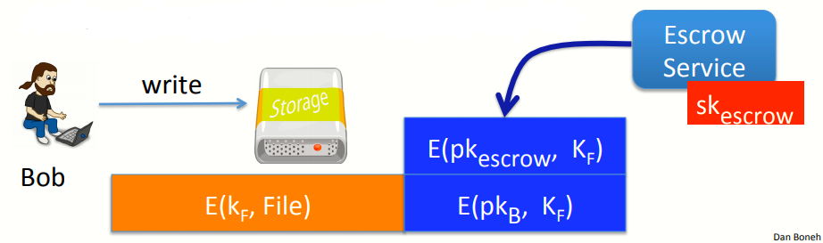
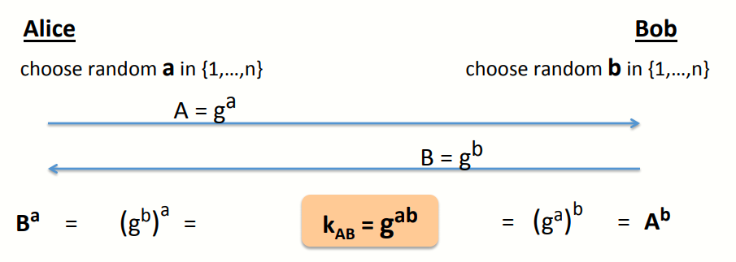
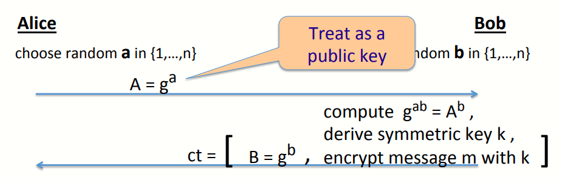
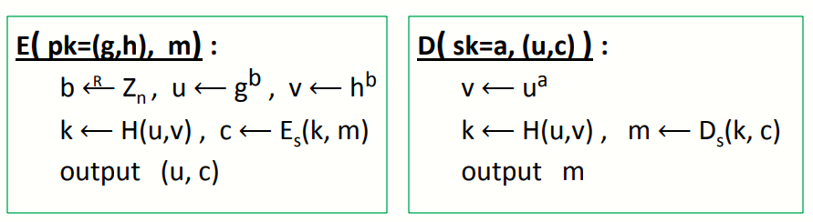

# W6 12-1 The ElGamal Public-key System

上一章讨论了基于RSA的公钥加密系统（一种建立在陷门函数基础上的系统），本章介绍另一个公钥加密系统，建立在D-H密钥交换协议上

## 1、Recap：public key encryption：(Gen,E,D)

回忆一下，公钥系统由三个算法G、E、D组成，其中加密算法E使用公钥，解密算法D使用私钥

## 2、Recap：public-key encryption applications

上一章中还讨论了公钥加密系统的一些应用，如密钥交换（HTTPS），还有一些非交互的应用（如安全Email、文件系统加密等）

比如文件系统加密，Bob想要加密文件并保存到某个存储服务器上，则其只要保存加密过的文件到服务器上即可

首先生成一个随机的文件加密密钥K~F~，然后用对称加密系统与该密钥加密这个文件，接着将K~F~用其自己的公钥pk~B~加密，并附在文件首部，这样Bob就能在以后的某个时间访问这些文件（先用私钥恢复K~F~，然后用K~F~恢复文件）

如果此时Bob希望Alice也有权限访问这个文件，则需要在文件首部加上用Alice的公钥pk~A~加密的K~F~，且这个过程无需Bob与Alice通信，只需要Bob获取Alice的公钥即可将该文件分享给Alice，同样Alice访问文件也无需与Bob交互

非交互情景的公钥加密系统还有一种应用，成为密钥托管（看起来很蠢），实际上是在企业环境中必备的一个功能

比如Bob把数据写到了磁盘里，然后一段时间后Bob不见了（离职、休假、出差等），但是公司需要Bob保存的文件，如果此时Bob是唯一可以解密的人，显然非常不现实，因此企业必须要有一种方式可以访问到Bob的文件，因此提出了密钥托管的概念

Bob 将他的文件写入磁盘时，这个系统会把他的文件写入到共享的媒介中，系统先向往常一样用密钥K~F~加密，然后用Bob的公钥pk~B~加密，并记录到文件头中，然后系统会把K~F~用密钥托管服务的密钥pk~escrow~加密一次（该过程密钥托管系统处于离线状态）

此时如果公司需要恢复Bob的文件，公司会联系密钥托管服务，读取文件头并用私钥解密，恢复K~F~，然后用K~F~解密文件

## 3、Constructions

之前的课程中提到了许多建立在陷门函数基础上的系统，比如说ISO标准和OAEP+等其它系统

本章会介绍建立在D-H密钥交换协议山东个公钥加密系统，称为ElGamal公钥加密方案（ElGamal方案由Taher Elgamal提出，T.E.其实是Marty Hellman的学生，提出后又作为了他的博士论文的一部分），但出于一些历史原因，ElGamal还被用在了GPG邮件加密系统中（GNU Privacy Guard）

和以往一样，构造公钥加密系统是，目标是构造一个满足CCA安全的系统，这样即可以防止监听，又可以防止篡改

## 4、Review：the Diffie-Hellman protocol(1997)

先回顾一下D-H密钥交换协议（回避之前讲的要抽象一些）

有限循环群G：比如(Z~p~)^*^，或者可以是椭圆曲线上的点集，记其阶为n

生成元g：由g的不断幂运算可以得到群G中所有元素，注意到G的阶位n，因此G的元素为g^0^=1到g^n-1^

然后回顾一下D-H协议

## 5、ElGamal：converting to pub-key enc.

然后看看D-H协议如何转化成公钥系统，还是D-H协议

首先确定群G和生成元g，第一步是密钥生成，将A视为公钥而a视为私钥，若期望由公钥推算出私钥本质上是解决一个离散对数问题

假设Bob需要将加密信息发送个Alice，此时Bob需要完成D-H密钥交换中他自己的那一部分，即随机选择b并计算B=g^b^，并且计算共享密钥k=g^ab^，然后利用该共享密钥加密自己要传输的信息，并将B与加密消息一起发送给Alice

其实这个流程和D-H协议完全一样，只不过Bob会立即使用共享密钥发送信息

此时Alice收到后，利用Bob的B计算出共享密钥k，然后用k解密消息即可

值得注意的是，某种程度上说这是一种随机加密方法，BOb每次想要加密一个消息时都需要重新选择一个随机的b，并用这个b生成密钥并加密消息

## 6、The ElGamal system (a modern view)

接下来看更详细的ElGamal系统，先确定一些东西

* G：阶为n的有限循环群

* (E~s~,D~s~)：定义在(K,M,C)上的对称加密系统，提供认证加密

* H：hash函数，将一堆群中的元素映射到密钥空间，即G^2^⟶K

然后定义公钥加密系统(Gen,E,D)，其中：

* Gen：密钥生成算法，从群G中随机选择一个生成元G，然后在Z~n~中随机选择一个指数a作为私钥，公钥pk=(g,h=g^a^)（不采用固定生成元的目的是增加安全性，随机选择一个生成元也不是什么很难的工作）

* (E,D)：加解密算法

  

  比如Bob想要加密消息：

  1. 先从Z~n~中随机选择b（即完成D-H协议中Bob发送给Alice的那部分），计算u=g^b^，v=h^b^=g^ab^
  2. 利用u和v计算对称加密需要的密钥k=H(u,v)（由于u将要发送出去，因此攻击者可以接获到u的值，而v是攻击者不知道的，因此出于安全考虑，将u和v一起计算hash值会比较好）
  3. 然后加密消息c=E~s~(k,m)
  4. 最后算法输出(u,c)

  解密消息流程如下：

  1. 计算v=u^a^
  2. 计算对称密钥k=H(u,v)
  3. 由对称密钥解密密文c
  4. 输出明文m

## 7、ElGamal perfomance

加密过程中有两个幂运算的步骤（计算u和v），解密只有一次幂运算（计算v），由于加密时的幂运算的底数g和h都由公钥推导出，因此每次都是不变的，而解密时的底数u每次都不同，因此加密速度并不完全是解密速度的两倍

由于底数不变，因此可以通过提前计算重复平方的每一步来加速加密过程，如果有更大的表来保存提前计算好的值的话，可以更快完成计算