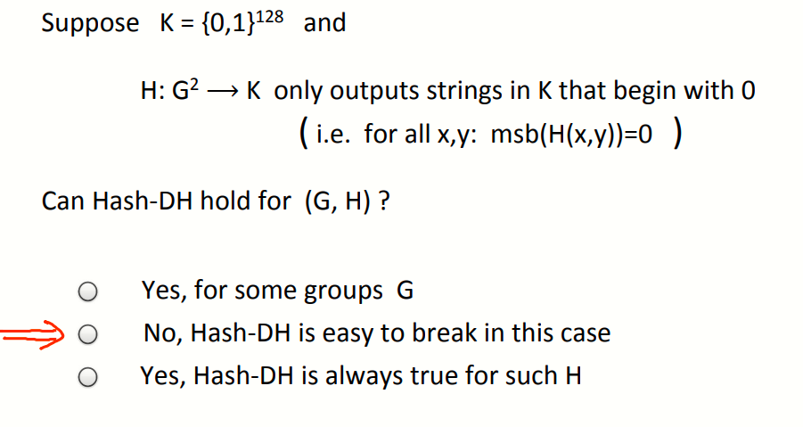
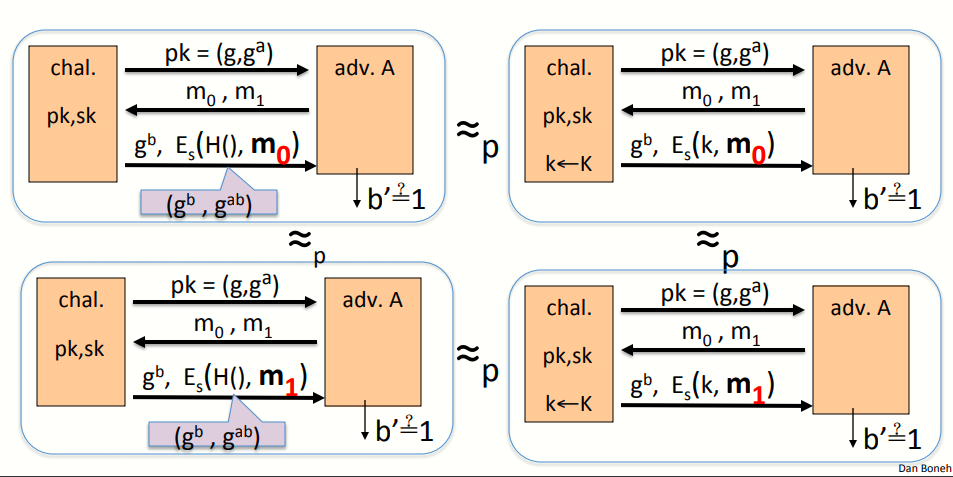
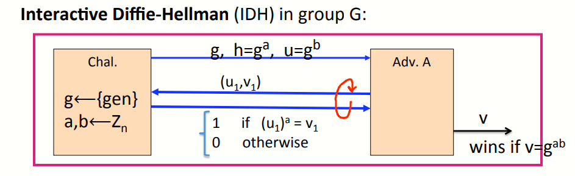

# W6 12-2 ElGamal Security

## 1、Computational Diffie-Hellman Assumption

之前介绍D-H密钥交换协议时，提到了攻击者有g、g^a^，g^b^，而计算共享密钥g^ab^是困难的，这里的困难指的是计算性DH假设（CDH），接下来更深入的看这个假设

考虑一个n阶的有限循环群G，如果对于任意高效算法A，其由g、g^a^、g^b^计算得到g^ab^的概率可忽略不计，则称在群G上满足CDH假设，即满足如下不等式
$$
Pr[ A(g,g^a,g^b)=g^{ab})] <negligible
$$

## 2、Hash Diffie-Hellman Assumption

上述假设并不能满足ElGamal的安全性分析，因此引入一个更强的假设，Hash Diffie-Hellman假设

还是考虑一个阶为n的有限循环群G，引入一个hash函数，其将G中的一对元素映射到密钥空间K，即G^2^→K

则Hash-DH（HDH）假设在(G,H)满足下列条件时成立

 * 在群G中随机选择一个元素g，Z~n~中随机选择a和b，K中随机选择R，则下列分布在计算上不可区分
   $$
   (g,g^a,g^b,H(g^b,g^{ab})) \approx_p (g,g^a,g^b,R)
   $$
   H为ElGamal系统计算得到的对称密钥，R为密钥空间随机选择的值，如果两者不可区分（即一个真随机的独立密钥看起来像是由g^a^和g^b^派生的密钥一样），则HDH成立

DHD假设是一个条件更强的假设，强于CDH假设，即当HDH是困难的话，则CDH也是困难的（可以反证法证明），有些群上CDH是困难的，但HDH不是（理解不了的话就记住一句话：HDH可以证明ElGamal系统是语义安全的）

看一个小例题

假定我们的密钥空间是一个128 bits的01比特流，哈希函数H会把G^2^上的元素映射到K中，如果我们选择一个hash函数，其只输出第一位是0的比特流，那么HDH假设在G,H)上成立吗？

由于hash函数输出的第一位总是0，则可以很容易区分这两个分布，从K中随机选择的元素第一位为0和1的概率都为0.5，而hash函数的分布总是输出0，因此可以区分两个不同的分布

结论：即便CDH在群G中式困难的，如果选择了一个坏的hash函数，则HDH假设在G,H)也不成立

## 3、ElGamal is sem. secure under Hash-DH

要证明在HDH假设下的EIGamal是语义安全，还是和以前一样，我们假设2种不同的实验（如下图所示）

挑战者首先将公钥发送给攻击者，攻击者选择两个等长的消息返回给挑战者，然后挑战者向攻击者返回对应的ElGamal加密过的消息

然后由DHD假设可知，攻击者知道g、g^a^，g^b^，但无法区分经过hash函数计算的g^b^和g^ab^（对攻击者而言和随机数一样无法区分）

因此如果在H()处用随机生成的密钥k取代hash函数（上图右侧），由HDH假设可知，攻击者无法区分两个不同的实验，又由于对称加密系统是语义安全的，因此ElGamal系统是语义安全的

## 4、ElGamal chosen ciphertext security?

仅仅做到语义安全是不够的，我们想要的是选择密文安全，问题在于ElGamal系统是CCA安全的吗？但就目前的HDH或CDH假设不足以证明该系统是CCA安全，需要一个更强的假设来来证明

接下来介绍一个新的假设，交互D-H假设（Interactive Diffie-Hellman,IDH），用其来进行CCA分析

和之前一样，挑战者将g、g^a^、g^b^发送给攻击者，若攻击者找到了密钥g^ab^则算其成功，和CDH没有区别，但我们赋予了攻击者查询的能力，因此条件比CDH更强

假设攻击者从G中选取了两个元素u~1~和v~1~并发送给挑战者，挑战者会告知(u~1~)^a^是否等于v~1~（ElGamal的加密步骤中需要计算u=g^b^，v=g^ab^）

假设赋予攻击者如此能力，且可以进行人亦多次的查询，仍然无法找到D-H的密钥，换句话说，即便是完成了所有的询问，其找到密钥的可能性仍然可以忽略不计，即有如下不等式
$$
\forall \ \ efficient\ \   A: Pr[A outputs g^{ab}] < negligible
$$
显然，若IDH假设成立，则CDH假设也成立（因为IDH假设比CDH假设更强）

结论：当IDH假设成立，且由对称加密系统提供认证加密，涉及到的hash函数均为理想函数的情况下，ElGamla系统为CCA安全的

新的问题：能否摆脱IDH假设，即能否在CDH假设的基础上证明CCA安全，同样的能否不依赖随机性来证明安全性（即不需要假定hash函数是理想的），下节课讨论