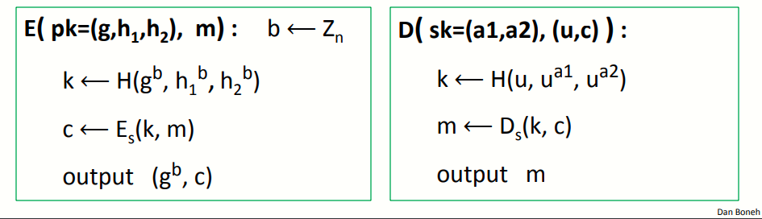
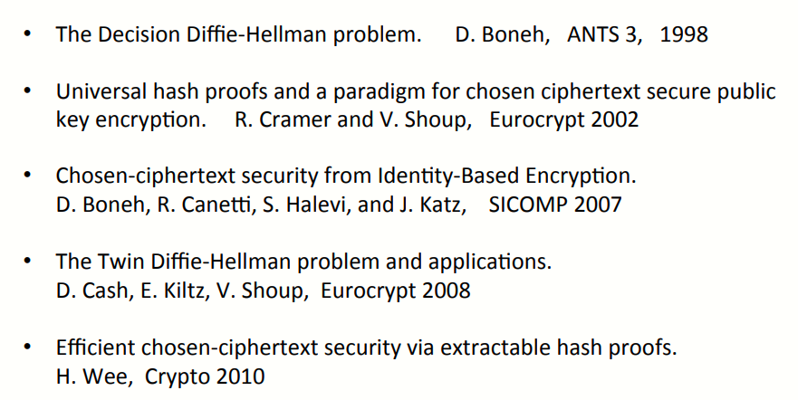

# W6 12-3 ElGamal Variants With Better Security

## 1、Review：ElGamal encryption

复习一下ElGamal的加解密流程（看之前的内容）

## 2、ELGamal chosen ciphertext security

上一节末尾提到了能否摆脱IDH，在CDH的基础上证明CCA安全？

可以，有两种方法可以做到：

 * 使用CDH=IDH的群（比如双线性群，一种由非常特殊的椭圆曲线构成，有更多的代数结构可以证明CDH与IDH的等价性）
 * 如果不想使用椭圆曲线群，可以开遍ElGamal系统，使其直接基于CDH证明CCA安全

## 3、Variants：twin ElGamal

对ElGamal做一个简单的变化

首先还是从G中选择生成元g，然后在Z~N~中选择两个指数(a1,a2)作为私钥sk，公钥pk=(g,h~1~=g^a1^,h~2~=g^a2^)，然后加解密和原来的ElGamal一样，只不过是用了参数更多的公钥和私钥而已

## 4、Chosen ciphertext security

上述简单的小改动可以让我们直接基于CDH证明ElGamal的CCA安全

首先还是需要假设对称加密系统提供认证加密，H为理想hash函数，若CDH假设在群G上成立，则twin ElGamal为CCA安全的

但是带来了额外的开销，为了严格的基于CDH假设证明CCA安全，需要在加解密步骤中额外进行一次幂运算，问题在于这么做值得吗（哲学问题：加解密需要更多的开销，但是使得CCA安全可以基于一种更自然的假设）

是否有一些群，使得CDH假设成立而IDH假设不成立？如果有那就太好了，这些群显然对于上述小改动是值得的，因为CDH成立但IDH不成立，因此twin ElGamal安全而普通ElGamal不安全

但是很可惜，不知道是否有这种群，就目前而言，任何群中若CDH假设成立，则IDH也成立，因此还是这个哲学问题，额外的开销到底值不值

但是这仍然是一个巧妙的改动，可以直接使用CDH假设实现CCA安全而无需将ElGamal改动的太多

## 5、ElGamal security w/o random oracles?

是否可以回避hash函数是理想的这个假设？即是否可以无需理想hash函数来证明CCA安全？

对于ElGamal而言，有两个选择：

 * 在双线性群中使用HDH假设（扩展阅读：Special elliptic curve with more structure [CHK'04+BB'04]）
 * 在任何群中使用DDH假设（Decision-DH，决策DH假设）（扩展阅读：CS'98）

## 6、Further reading

1. 教授本人的论文，讨论了与DH有关的各种假设，特别研究了决策DH假设
2. 展示了如何从DH和类似的假设中构建CCA安全的系统
3. 从双线性群中建立CCA安全（该论文提出了一种基于身份的加密）
4. Twin DH结构及其证明
5. 提供了构建通用的CCA安全的系统框架（使用可提取hash证明）