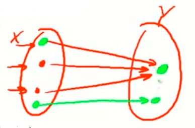
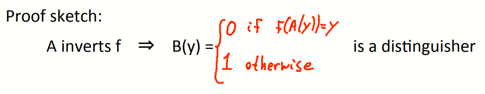

# W6 12-4 A Unifying Theme

本周学习了RSA和ElGamal两种公钥系统，前者基于陷门函数，后者基于D-H协议，其实这两者都遵循一个统一原则，即单向函数

## 1、One-way functions (informal)

单向函数f：X→Y，正向计算非常简单，但是计算f的逆函数很困难（对于X到Y的映射，给出x∈X找到Y中的映射y很简单，但是给出y∈Y，找到X中的原像很难），即有如下不等式
$$
Pr[\ \ f\ (A\ (f(x))\ )\ \ =f(x)]<negligible
$$
上述不等式表明，对于所有有效的算法A，如果将函数f重新应用于A的输出，其得到原来的点的几率应当是可忽略的

单向函数的存在：可以归约到P=NP问题

## 2、Ex.1: generic one-way functions

接下来看一个例子（一个假定的单向函数），由伪随机数生成器构造而来

记f:X→Y为一安全PRG（|Y|>>|X|）

引理：若f为一安全PRG，则f为一单向函数

证明：里用反证法，假设f不是单向的，假设有一个计算f的逆的有效算法A，则可以构造一个破解PRG的算法B，具体如下

​	给定y∈Y，并将y输入算法A，然后计算f(A(y))，如果其最终输出了f的种子y，则算法B可以以不可忽略的概率输出0，否则输出1（输出1意味着B得到的是一个真随机串，难以找到一个种子是的PRG生成真随机串）

​	若给定某个输出y，y部署于PRG的输出集合，则没有使得生成器映射到这个y的种子，因此若给定Y中某个真随机的点，B会以高概率输出1

​	但拖给定的是PRG的输出，则A会输出其对应的种子，然后再由该种子得到这个输出，从而B会输出0

​	上述分析可知，若A可以计算f的逆，则B可以破坏PRG，又由于假设PRG为安全的，由反证法可得，A并不可以计算f的逆，因此f为单向函数，得证

事实上，利用PRG可以直接构造出单向函数，但是这类单向函数没有什么特别的，这意味着很难在公钥加密系统的密钥交换中使用这类函数

## 3、Ex.2: The DLOG one-way function

看第二个例子，定义N阶循环群G，生成元为g，定义函数f：f(x)=g^x^，即将Z~N~（0~N-1中元素构成的集合）映射到G，该问题是个离散对数问题

引理：如果离散对数问题是困难的，则f为单向函数

一些有趣的性质：若已知f(x)和f(y)，则计算f(x+y)很简单（加法性质），由于在循环群G内计算，从而使之是个陷门函数，这也使得密钥交换和公钥加密可行

## 4、Ex.3: The RSA one-way function

看第三个例子，RSA中选择两个大素数p和q，记N=pq，然后选择e，d使得ed ≡ 1 ( mod φ(N) )

定义函数f：f(x)=x^e^，为Z~N~^*^到Z~N~^*^的映射

引理：f在RSA假设下为单向函数

性质：f(x)*f(y)=f(x*y)（乘法性质）

陷门性：存在一个密钥，使得计算函数的逆非常简单，若没有这个密钥，则该函数是单向的

就目前而言，陷门性仍然是公钥加密算法的蜘蛛，且由于该函数的有陷门，使得RSA非常适合用于构造数字签名

## 5、Summary

基于一些有特殊性质的单向函数，可以构造密钥交换、公钥加密等等算法