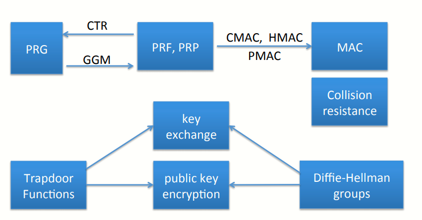

# W6 12-5 Farewell

## 1、Quick Review：primitives

第一周讨论了伪随机数生成器和流加密算法

第二周讨论块加密算法并将块加密视为伪随机置换和伪随机函数（利用CTR模式可以将块加密转换成PRG，利用GGM构造可以从PRG构造块加密算法）

第三周讨论了数据完整性，特别探讨了MAC及其各种形式的构造（如利用了PRG的CMA、HMAC、PMAC等），还讨论了抗碰撞性

第四周讨论了将完整性和保密性结合起来，特备讨论了如何将加密和MAC结合起来，从而构造认证加密（Authentic Encryption），但本质上仅能够放窃听攻击的加密算法并不是总体安全的，还需要提供防篡改功能，因此对称加密系统中需要时用包含认证加密的算法

第五周讨论了陷门函数和D-H协议（注意到密钥交换协议仅能防止窃听）

第六周讨论了利用陷门函数和D-H协议构造公钥加密算法

## 2、Remaining Core Topics（part II）

之后还会讨论数字签名和认证数据的内容，还有口令管理、挑战-响应协议、隐私机制（使得用户可以对自身身份进行验证同时又不会暴露身份，或者登陆的时候不暴露自己）、零知识证明（密码学中广泛使用的工具）

## 3、Many more topics to cover

之后会开高级密码学课程，包含椭圆曲线加密、量子计算、密钥管理范式、匿名数字现金、私人投票与拍卖系统、密文计算、全同态加密、格密码、双方/多方计算等知识点

感兴趣可以先学

>  最后再提醒一句：密码学是非常强大的工具，弱国使用不当反而会导致系统更容易被攻击